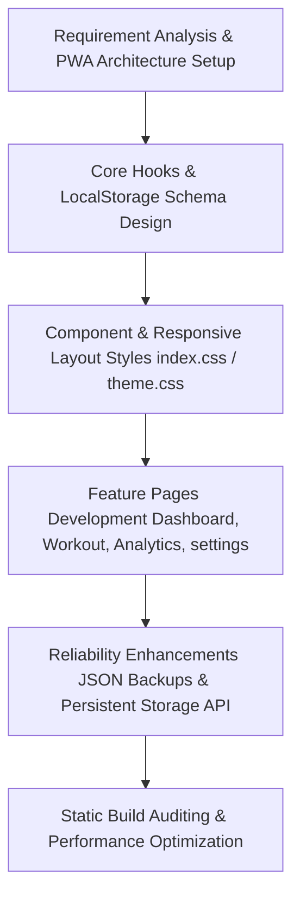

# Project Report: ⚡ IRONLOG

A Sleek, Offline-First, Privacy-Focused Workout Logger and Fitness Tracker.

---

## 1. Problem Definition
Traditional fitness tracking applications suffer from several key limitations:
- **Privacy and Data Monetization**: Most trackers store user routines, weights, and biometrics on remote cloud servers, exposing personal health data to breach risks and tracking.
- **Gym Connectivity Issues**: Workout facilities (especially basement gyms) frequently have weak cellular signals, causing server-dependent applications to lag, fail to sync, or block user access.
- **Subscription Gates**: Simple logging utilities are increasingly hidden behind aggressive paywalls and recurring subscriptions.
- **Data Loss and Device Lock-in**: Browser-based offline apps often run the risk of losing data during standard browser cleaning cycles or lack an easy mechanism to transfer information to a new device.

---

## 2. Project Objectives
**⚡ IRONLOG** was designed to address these concerns through a lightweight, web-standard application that meets the following objectives:
1. **Offline-First Resilience**: Enable fully functional workout logging, timer tracking, and progress visualization even in the complete absence of internet access.
2. **Absolute Privacy**: Maintain zero remote server dependencies. All user data, metrics, and profiles must remain 100% on the user's local hardware.
3. **Zero-Cost Lifecycle**: Design a serverless architecture that can be hosted and distributed for free, eliminating operational database maintenance fees.
4. **Data Ownership & Durability**: Provide simple export formats (CSV for spreadsheets, JSON for application databases) and ask the operating system for hard storage guarantees to prevent accidental data cleaning.

---

## 3. Technology Stack
The application is built using modern web standards to keep bundle sizes minimal and maximize compatibility:
- **Frontend Core**: React (v19) for declarative UI components and hooks-based state management.
- **Styling**: Vanilla CSS3 utilizing CSS variables (for instant Light/Dark mode transitions) and responsive Grid/Flexbox layouts.
- **State Management**: Custom React state hooks combined with LocalStorage interfaces.
- **Offline Caching**: Progressive Web App (PWA) configuration utilizing Service Workers to cache resources locally.
- **Browser Protection APIs**: HTML5 File API (FileReader) for backups and standard Storage Manager API (`navigator.storage.persist()`) to secure local database files.

---

## 4. Methodology
The project followed an agile, iterative implementation methodology:

1. **Schema Design**: Modeled relational tables (Workouts, Personal Records, Templates, Metrics) into key-value documents with unified prefixes (`il_`).
2. **PWA Shell Caching**: Built background workers to cache HTML, JavaScript, and fonts, ensuring loading occurs in under 1 millisecond.
3. **Defense Against Data Cleansing**: Configured storage persistence hooks and serialization layers to manage profile migration smoothly.

---

## 5. Detailed System Working & Architecture
The system contains five primary divisions operating concurrently on the client's device:

### A. Authentication & Shell Gate
- Evaluates the current active user locally. If no credentials exist, the application intercepts navigation using a localized gate (`LoginPage.js`), protecting local data keys on shared devices.

### B. Core Store Engine (`useStore.js`)
- Acts as an in-memory transactional database. Every state modification triggers a parallel execution thread that parses variables, converts them to string documents, and commits them to `localStorage`.

### C. Active Workout Logger & Rest Timer
- When starting a workout template (e.g., PPL or 5x5), the application spins up a tracking session.
- Individual sets (Warmup, Super, Drop, and standard working sets) can be marked complete.
- Checking a set initiates the **Rest Timer overlay**, utilizing web timers to count down resting periods in the background.

### D. Analytics & Visualization Engine
- Uses custom SVG generators (`LineChart.js`) to parse historical logs, calculate maximum volumes, and display estimated strength gains (e.g., Personal Records tracking).
- Provides visual frequency tables showing which muscle groups are trained most frequently.

### E. Database Backup, Restore, and Protection
- **Backup**: Loops through active local directories, grabs all `"il_"` prefixed strings, constructs a `.json` backup file, and prompts a local download.
- **Restore**: Receives files via browser file uploaders, runs structural sanity checks, replaces `localStorage` tables, and performs a full page reload to instantiate changes.
- **Persistence Request**: Uses the Storage Manager API to instruct the browser operating system to exempt **⚡ IRONLOG** from local file deletion policies.

---

## 6. Conclusion & Future Directions
**⚡ IRONLOG** proves that a sophisticated, premium-tier fitness application can run entirely within the client's browser with zero backend database costs. By utilizing PWA service workers and LocalStorage persistence APIs, we have created an application that is private, reliable, offline-capable, and completely owned by the user.

### Future Directions
- **Local SQLite Integration (WASM)**: Upgrading from LocalStorage to WebAssembly SQLite to support complex queries and relationships.
- **WebDAV / Private Cloud Syncing**: Allowing users to securely connect their personal Dropbox or Google Drive to automatically backup the JSON database file without compromising on personal privacy.
